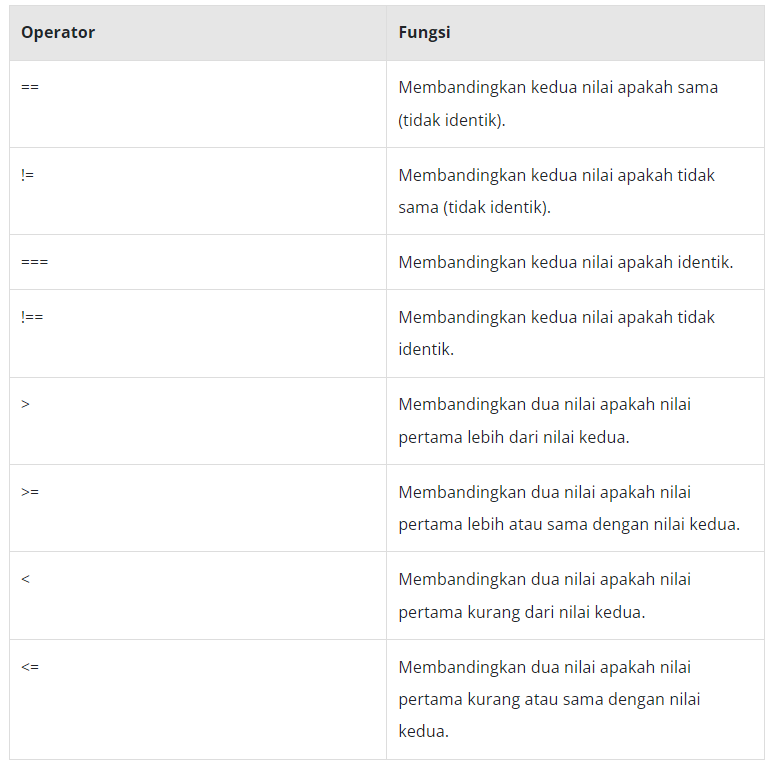

# Operator Pembanding

Terdapat serangkaian karakter khusus yang disebut dengan operator pembanding/komparasi yang dapat mengevaluasi dan membandingkan dua nilai. Berikut daftar operator dan fungsinya:



```js
const umurKhoirul = 25;
const umurDaffa = 21;

console.log(umurKhoirul < umurDaffa); // false
```

# Kondisi

Setiap hari kita melakukan perhitungan dan perbandingan dalam membuat keputusan, apa pun itu. Contohnya, apakah perlu membawa payung ketika hujan?

```js
const hujan = false;

if (hujan === false) {
  console.log("Tidak bawa payung");
} else {
  console.log("Bawa Payung");
}

const bahasa = "Indonesia";

switch (bahasa) {
  case "Inggris":
    console.log("Good Morning!");
    break;
  case "Jerman":
    console.log("Guten Morgen!");
    break;
  case "Prancis":
    console.log("Bonjour!");
    break;
  default:
    console.log("Selamat Pagi!");
}
```
