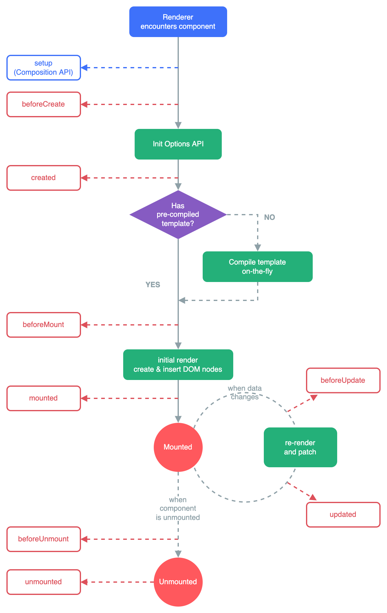
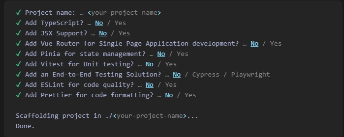

# VueJS (Framework Front End - JavaScript)

Vue (diucapkan /vyuː/, seperti view) adalah kerangka kerja JavaScript untuk membangun antarmuka pengguna. Vue dibangun di atas HTML standar, CSS, serta JavaScript dan berbasis komponen yang membantu Anda mengembangkan antarmuka pengguna secara efisien, baik yang sederhana maupun yang kompleks.

# Struktur Dasar

Dalam satu halaman file Vue, kita akan menjumpai sintaks berikut yang disebut Single-File Component:

```js
<template>

</template>

<script setup>

</script>

<style scoped>

</style>
```

- `<template>` digunakan untuk mendefinisikan tampilan komponen atau struktur HTML pada umumnya
- `<script>` digunakan untuk mendefinisikan logika pada aplikasi. Karena dituliskan `setup`, maka sintaks yang kita gunakan adalah Composition API
- `<style scoped>` digunakan untuk menulis styling (CSS) pada umumnya. `scoped` digunakan untuk membatasi style tersebut hanya untuk file ini saja

# Gaya Penulisan

VueJS memiliki 2 (dua) gaya penulisan, yaitu:

- ## Options

  Dengan Options, kita mendefinisikan logika komponen menggunakan objek options seperti `data`, `method`, ataupun `mounted`. Properti yang didefinisikan pada `data` diekspos pada `this`, yang menunjuk ke instance komponen:

  ```vue
  <script>
  export default {
    data() {
      return {
        angka: 0,
      };
    },
    methods: {
      tambahAngka() {
        this.angka++;
      },
    },
    mounted() {
      console.log(`Angka pertama kali: ${this.angka}.`);
    },
  };
  </script>
  ```

- ## Composition

  Dengan Composition , kita mendefinisikan logika komponen menggunakan hasil `import` dari fungsi . Dalam Single-File Component, pemakaian Composition ditandai dengan `<script setup>`. Dengan memakai Composition, menjadikan kode awal yang kita buat jadi lebih sederhana:

  ```vue
  <script setup>
  import { ref, onMounted } from "vue";

  const angka = ref(0);

  const tambahAngka = () => angka.value++;

  onMounted(() => {
    console.log(`Angka pertama kali: ${angka.value}`);
  });
  </script>
  ```

# VueJS Lifecycle Diagram



# Membuat Aplikasi VueJS

Sebelum membuat aplikasi VueJS, mohon pastikan sudah terinstall NodeJS minimal versi 16.0 atau lebih tinggi. Untuk membuat aplikasi Vuejs, bisa mengunjungi laman https://vuejs.org/guide/quick-start.html, atau bisa menuliskan kode di bawah ini pada terminal:

```
npm create vue@latest
```

kode tersebut akan mengeksekusi perintah pembuatan project Vuejs, lalu akan muncul beberapa pertanyaan berikut:


- Nama projek diisi dengan nama projek Anda
- <b><u>Tidak perlu</u></b> menambahkan TypeScript
- <b><u>Tidak perlu</u></b> menambahkan JSX Support
- <b><u>Tambahkan</u></b> Vue Router untuk perpindahan antar halaman
- <b><u>Tambahkan</u></b> Pinia untuk state management atau manajemen variabel global
- <b><u>Tidak perlu</u></b> menambahkan Vitest untuk testing
- <b><u>Tidak perlu</u></b> menambahkan End-to-End testing
- <b><u>Tambahkan</u></b> ESLint untuk penulisan kode kita lebih baik
- <b><u>Tambahkan</u></b> Prettier untuk memformat kode kita secara otomatis agar tidak berantakan
- Kemudian tunggu hingga selesai dan ikuti perintah selanjutnya

1. Masuk ke folder projek tersebut dengan perintah `cd nama-folder`
2. Install semua dependencies dengan perintah `npm install` atau `npm i`
3. Format folder dengan perintah `npm run format`
4. Install Tailwindcss dengan perintah `npm install -D tailwindcss postcss autoprefixer && npx tailwindcss init -p`
5. Buka projek yang sudah dibuat dengan perintah `code .`
